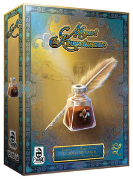

# Maestri del Rinascimento Board Game - AM59
Final examination for "Computer Science and Engineering" held at Politecnico di Milano (2020/2021)

## Authors
| Personal Data | Username |
|:-----------------------|:------------------------------------:|
| Anozie Hanson Obinna | [@hansonobi9](https://github.com/hansonobi9) |
| Chen Peizhou | [@cheeeeenais](https://github.com/cheeeeenais) |
| Cicellini Raffaele | [@raffaelecicellini](https://github.com/raffaelecicellini) |

## Implemented Functionalities
| Functionality | Status |
|:-----------------------|:------------------------------------:|
| Basic rules |  |
| Complete rules |  |
| Socket | |
| GUI |  |
| CLI | |
| Multiple games | |
| Local game |  |

#### Legend
 Not Implemented &nbsp;&nbsp;&nbsp;&nbsp; Implementing&nbsp;&nbsp;&nbsp;&nbsp; Implemented

<!--

-->

